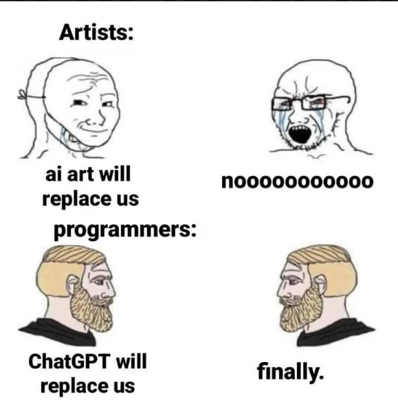
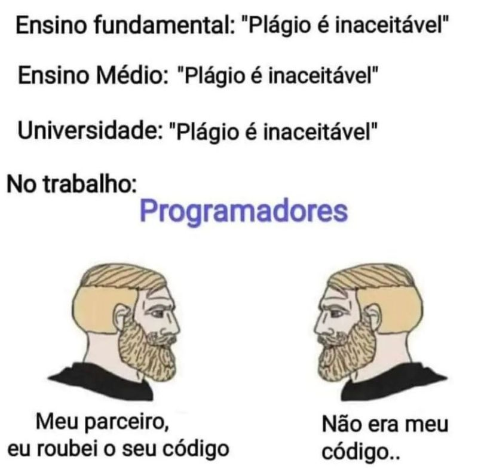
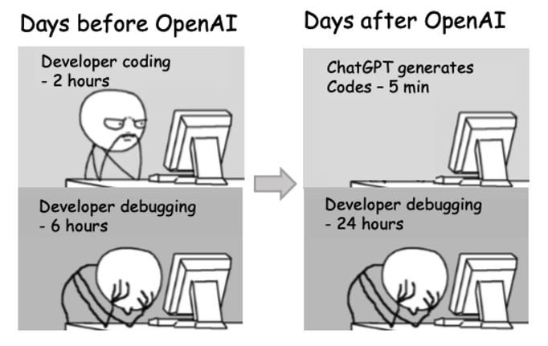

# Treinando React

Comecei esses respositório com o objetivo de aprender React, e treinar sua sintaxe para um projeto de programação que estou começando com alguns amigos. Dado que o projeto, pelo menos um modelo planejamos em rodar no Electron, sera necessario(e confesso que estou quase entregando curriculo pro exercito Ucrâniano, pois a programação anda lado a lado com a depressão kkkkkk)

  

Este repositório contém scripts e exemplos de código relacionados ao treinamento de React. Os scripts fornecidos aqui são apenas para treinar a sintaxe e não são funcionais por si só. 

Usei o VS Code justamente pelo TabNine(essa ferramenta foi a melhor coisa desde o pão de forma fatiado) e também usei o Gemini e o ChatGPT para estudos, dado que eles fornecem códigos robustos, mas você perde 90% do tempo livre debugando.

  

## Estrutura do Repositório

Basicamente criei um script para cada modulo do w3School, onde pensei em não aprender que veiculo tem rodas e carro é um veiculo de 4 rodas(?), mas e sim projetos praticos no mundo real, como endpoints conectando no Back-End, consulta no banco de dados, Hoooks, etc...

  

## Observação

Os scripts fornecidos neste repositório são apenas para fins educacionais e de treinamento. Eles não são funcionais por si só e podem precisar de adaptações para serem utilizados em um projeto real.

Sinta-se à vontade para explorar os exemplos de código fornecidos e experimentar com eles para praticar suas habilidades em React.

  

